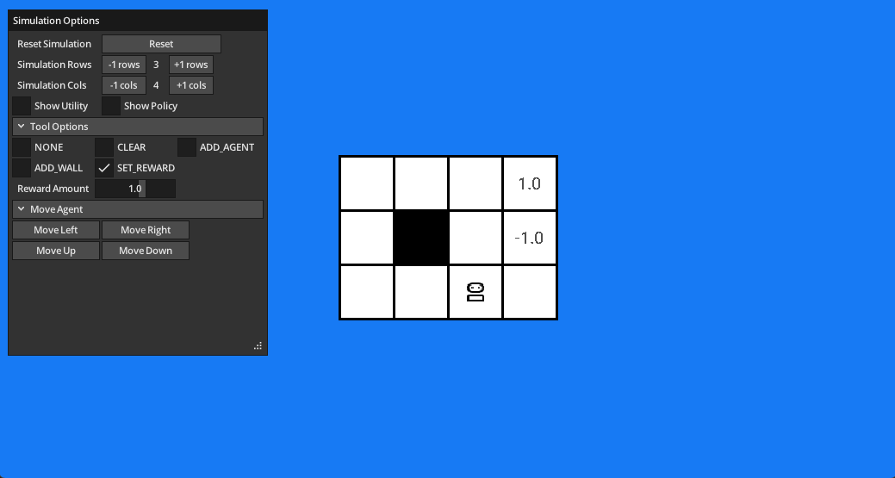

# HRI Simulator in Odin (WIP)



## Requirements

- [Odin nightly](https://odin-lang.org/docs/nightly/)
- Libs
    - SDL2
    - SDL2 image
    - SDL2 ttf
    - zlib
    - libpng16-16
- [Just](https://github.com/casey/just) (OPTIONAL)

To Run:

```bash
just run
```